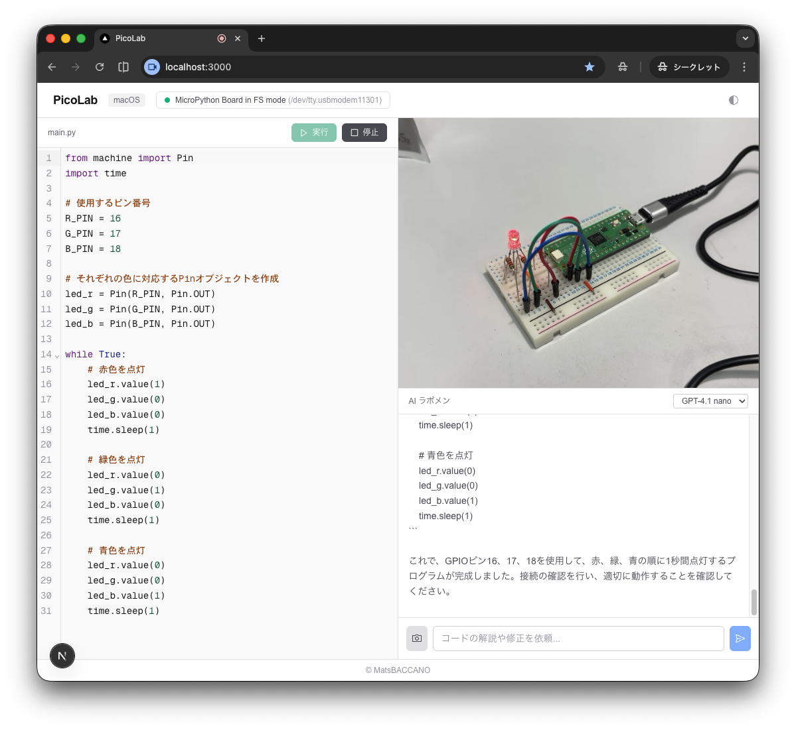

# PicoLab

AIと会話しながら Raspberry Pi Pico の電子回路を作る開発環境です。

ブラウザ上のエディタから MicroPython コードを編集し、USB 経由で Pico に転送・実行できます。



## 前提条件

- Node.js 22 以上
- Python 3（mpremote のインストールに必要）
- Raspberry Pi Pico
- USB ケーブル（Pico と PC の接続用）

## 対応 OS

- macOS
- Windows（Windows 10 以降は USB ドライバ自動認識）
- Linux

## Pico のファームウェアセットアップ

初めて Pico を使う場合、MicroPython ファームウェアの書き込みが必要です。

### 1. ファームウェアのダウンロード

[MicroPython 公式ダウンロードページ](https://micropython.org/download/RPI_PICO/) から Raspberry Pi Pico 用の `.uf2` ファイルをダウンロードしてください。

### 2. Pico をストレージモードで接続

Pico 基板上の **BOOTSEL ボタンを押しながら** USB ケーブルで PC に接続します。`RPI-RP2` という名前の USB ドライブとして認識されます。

### 3. ファームウェアの書き込み

ダウンロードした `.uf2` ファイルを USB ドライブにコピーします。

**macOS / Linux:**

```bash
cp RPI_PICO-*.uf2 /Volumes/RPI-RP2/
```

**Windows:**

エクスプローラーで `RPI-RP2` ドライブを開き、`.uf2` ファイルをドラッグ＆ドロップしてください。

コピー完了後、Pico が自動的にリブートし MicroPython が使えるようになります。

### 4. mpremote のインストール

PC から Pico にプログラムを転送するために `mpremote` をインストールします。

```bash
pipx install mpremote
```

> `pipx` がない場合は `pip install mpremote` でもインストールできます。

### 5. 接続確認

**macOS / Linux:**

```bash
mpremote connect /dev/tty.usbmodem* exec "import sys; print(sys.implementation)"
```

**Windows:**

```bash
mpremote connect COM3 exec "import sys; print(sys.implementation)"
```

> COM ポート番号はデバイスマネージャーで確認してください。

MicroPython のバージョン情報が表示されれば準備完了です。

## インストールと起動

```bash
npm install
npm run dev
```

http://localhost:3000 にアクセスしてください。

## 環境変数

`.env.local` に API キーを設定してください（AI ラボメン機能に必要）。

```
OPENAI_API_KEY=your-api-key-here
```

## 使い方

1. エディタに MicroPython コードを記述
2. 「実行」ボタンで Pico にコードを転送・実行
3. 「停止」ボタンで実行を停止
4. AI ラボメン（右パネル）にコードの解説や修正を依頼
5. ヘッダー右上のボタンでダーク/ライトモードを切り替え

## 技術スタック

- Next.js 16 (App Router)
- TypeScript
- Tailwind CSS 4
- OpenAI API（AI ラボメン）
- CodeMirror 6（コードエディタ）
- MicroPython + mpremote

## ライセンス

MIT License &copy; MatsBACCANO
